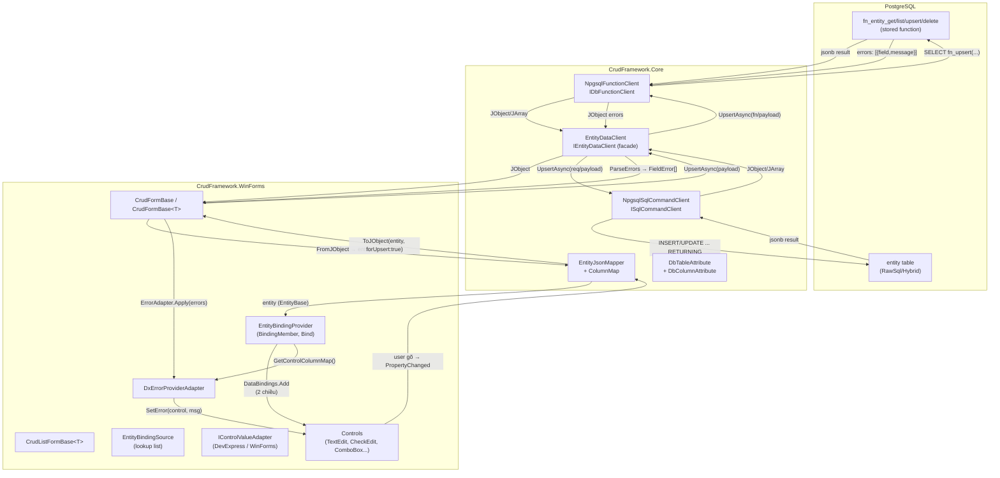

# Cẩm nang phát triển CrudFramework — `docs/developments.md`

> **Mục tiêu:** 1 dev mới đọc xong file này → tự tạo được entity mới + form CRUD mới mà không cần hỏi ai.

Mọi API/tên class/property/attribute trong file này đã đối chiếu 100% với source code thật
(`CrudFramework.Core`, `CrudFramework.WinForms`, `CrudFramework.Sample`). **KHÔNG bịa**.

---

## 1. Quy trình tạo 1 entity mới từ đầu tới cuối

### Checklist đánh số (có ví dụ code thật)

#### 1.1 Viết SQL fixture — 4 function `fn_<entity>_get/list/upsert/delete`

Mọi giao tiếp DB đi qua 4 stored function PostgreSQL (trả jsonb). Tham khảo mẫu
[`sql/01_customers.sql`](../sql/01_customers.sql).

**Contract input/output của từng function:**

| Function | Input | Output | Mô tả |
|---|---|---|---|
| `fn_<entity>_get` | `p_id INT` | `jsonb` — 1 record (object) hoặc `null` | Đọc 1 bản ghi theo id |
| `fn_<entity>_list` | `p_filter JSONB` | `jsonb` — array các record | Liệt kê theo filter (keyword, active, date range...) |
| `fn_<entity>_upsert` | `p_payload JSONB` | `jsonb` — `{success: bool, data: object, errors: [{field,message}]}` | Thêm/sửa, validate, trả kết quả |
| `fn_<entity>_delete` | `p_id INT` | `jsonb` — `{success: bool, message: text}` | Xóa 1 bản ghi |

**Ví dụ `fn_customers_list` (trích từ `sql/01_customers.sql`):**

```sql
CREATE OR REPLACE FUNCTION fn_customers_list(p_filter jsonb)
RETURNS jsonb
LANGUAGE plpgsql
AS $$
DECLARE
    v_keyword TEXT := NULLIF(p_filter->>'keyword','');
    v_is_active BOOLEAN := CASE WHEN p_filter ? 'is_active'
                                THEN (p_filter->>'is_active')::boolean ELSE NULL END;
    v_result jsonb;
BEGIN
    SELECT COALESCE(jsonb_agg(to_jsonb(t) ORDER BY t.id), '[]'::jsonb)
    INTO v_result
    FROM (
        SELECT id, customer_code, customer_name, birth_date, balance, is_active
        FROM customers
        WHERE (v_keyword IS NULL OR customer_name ILIKE '%'||v_keyword||'%')
          AND (v_is_active IS NULL OR is_active = v_is_active)
    ) t;
    RETURN v_result;
END;
$$;
```

**Giải thích contract:**
- `p_filter` là jsonb, mỗi key là 1 tiêu chí lọc (VD `keyword`, `is_active`). Key không dùng bị
  bỏ qua an toàn.
- `fn_<entity>_upsert`: nếu validate lỗi → trả `{success:false, data:null, errors:[...]}`.
  Nếu thành công → trả `{success:true, data:{id,...}, errors:[]}`.
- `fn_<entity>_delete`: `success:true` + `message`; `success:false` nếu không tìm thấy.

#### 1.2 Viết entity C# kế thừa `EntityBase`, gắn `[DbTable]`/`[DbColumn]`

```csharp
using System;
using CrudFramework.Core.Attributes;
using CrudFramework.Core.Entities;

namespace CrudFramework.Sample
{
    [DbTable("customers", FunctionPrefix = "fn_")]
    public class Customer : EntityBase
    {
        private int _id;
        private string _customerCode;
        private string _customerName;
        private DateTime? _birthDate;
        private decimal _balance;
        private bool _isActive;

        [DbColumn("id", Caption = "Mã", Width = 60, ReadOnly = true, Order = 1)]
        public int Id { get { return _id; } set { SetField(ref _id, value); } }

        [DbColumn("customer_code", Caption = "Mã KH", Width = 100, Order = 2)]
        public string CustomerCode { get { return _customerCode; } set { SetField(ref _customerCode, value); } }

        [DbColumn("customer_name", Caption = "Tên khách hàng", Width = 220, Order = 3)]
        public string CustomerName { get { return _customerName; } set { SetField(ref _customerName, value); } }

        [DbColumn("birth_date", Caption = "Ngày sinh", Width = 110, Format = "dd/MM/yyyy", Order = 4)]
        public DateTime? BirthDate { get { return _birthDate; } set { SetField(ref _birthDate, value); } }

        [DbColumn("balance", Caption = "Số dư", Width = 120, Format = "n0", Order = 5)]
        public decimal Balance { get { return _balance; } set { SetField(ref _balance, value); } }

        [DbColumn("is_active", Caption = "Hoạt động", Width = 90, Order = 6)]
        public bool IsActive { get { return _isActive; } set { SetField(ref _isActive, value); } }
    }
}
```

**Giải thích từng field của `[DbTableAttribute]`:**

| Property | Kiểu | Mặc định | Mô tả |
|---|---|---|---|
| `Name` | `string` | *(bắt buộc)* | Tên entity/bảng (VD `"customers"`). Chỉ chấp nhận `[a-z0-9_]`. |
| `FunctionPrefix` | `string` | `"fn_"` | Prefix tên function. Function = `{Prefix}{Name}_{action}`. |
| `Schema` | `string` | `null` | Schema PostgreSQL (VD `"sales"`). Null → dùng `search_path`. Chỉ `[a-z0-9_]`, bắt đầu chữ/`_`. |
| `KeyColumn` | `string` | `"id"` | Cột khóa chính cho RawSql/Hybrid (WHERE, ON CONFLICT). Chỉ `[a-z0-9_]`. |

Method `GetFunctionName(action)` trả `"schema.fn_name_action"` hoặc `"fn_name_action"`.

**Giải thích từng field của `[DbColumnAttribute]`:**

| Property | Kiểu | Mặc định | Mô tả |
|---|---|---|---|
| `Name` | `string` | `null` → suy ra từ property name (PascalCase→snake_case) | Tên cột JSON/DB. |
| `Caption` | `string` | `null` → dùng property name | Tiêu đề hiển thị header lưới / label. |
| `Width` | `int` | `0` (= auto) | Độ rộng cột GridControl. |
| `Format` | `string` | `null` | Format string (VD `"n0"`, `"dd/MM/yyyy"`, `"#,##0.00"`). |
| `Order` | `int` | `int.MaxValue` | Thứ tự cột lưới (nhỏ hơn → trước). |
| `Ignore` | `bool` | `false` | `true` → KHÔNG serialize, KHÔNG sinh cột lưới. |
| `ReadOnly` | `bool` | `false` | `true` → hiện trên lưới nhưng KHÔNG ghi vào JSON upsert. |
| `HiddenInGrid` | `bool` | `false` | `true` → serialize vào JSON nhưng ẩn khỏi lưới. |

#### 1.3 Chọn `DbCommandMode` (Function / RawSql / Hybrid)

| Mode | Khi nào dùng | Cần client nào | Ví dụ khởi tạo |
|---|---|---|---|
| `Function` (mặc định) | DB có 4 stored function → an toàn nhất, logic ở DB | `IDbFunctionClient` | `new EntityDataClient(typeof(Customer), DbCommandMode.Function, fnClient, null)` |
| `RawSql` | DB không có stored function, framework tự sinh SQL tham số hóa | `ISqlCommandClient` | `new EntityDataClient(typeof(Customer), DbCommandMode.RawSql, null, sqlClient)` |
| `Hybrid` | Đa số RawSql, nhưng vài action cần SQL đặc thù (escape hatch) | `ISqlCommandClient` + `ISqlOverrideProvider` | `new EntityDataClient(typeof(Order), DbCommandMode.Hybrid, null, sqlClient, overrides)` |

**Ví dụ dùng `EntityDataClient` cho từng mode (đúng theo `EntityDataClient.cs`):**

```csharp
// === Function mode (mặc định) ===
var fnClient = new NpgsqlFunctionClient(connectionString);
IEntityDataClient data = new EntityDataClient(typeof(Customer), DbCommandMode.Function, fnClient, null);

// === RawSql mode — tự sinh SQL từ metadata ===
var sqlClient = new NpgsqlSqlCommandClient(connectionString);
IEntityDataClient data = new EntityDataClient(typeof(Customer), DbCommandMode.RawSql, null, sqlClient);

// === Hybrid — RawSql + override vài câu lệnh ===
IEntityDataClient data = new EntityDataClient(
    typeof(Order), DbCommandMode.Hybrid, null, sqlClient, myOverrides);
```

Tầng UI chỉ làm việc với facade `IEntityDataClient` — không cần biết chế độ bên dưới.

**Escape hatch — override SQL (Hybrid):**

```csharp
public sealed class OrderSqlOverrides : ISqlOverrideProvider
{
    public string GetSql(RawSqlRequest r)    { return null; }   // dùng SQL tự sinh
    public string ListSql(RawSqlRequest r)   { return "SELECT * FROM sales.v_orders_active"; }
    public string UpsertSql(RawSqlRequest r) { return null; }
    public string DeleteSql(RawSqlRequest r) { return null; }
}
```

> SQL override **bắt buộc** dùng named parameter (`:id`, `:p_payload`, `:p_filter`) và
> **không** nối chuỗi giá trị.

#### 1.4 Tạo List Form và Detail/Edit Form

**List Form** — kế thừa `CrudListFormBase<TEntity>`:

```csharp
public partial class CustomerListForm : CrudListFormBase<Customer>
{
    private IDbFunctionClient _client;

    public CustomerListForm(IDbFunctionClient client)
    {
        InitializeComponent();
        _client = client;
        Client = client;
        Grid = gridControl1;
        View = gridView1;
        InitializeGrid();    // tự sinh cột từ [DbColumn]
        Load += async (s, e) => await LoadListAsync();
    }

    public override void OpenDetail(int? id)
    {
        using (var frm = new CustomerDetailForm(_client, id))
        {
            if (frm.ShowDialog(this) == DialogResult.OK)
                LoadListAsync();   // refresh grid
        }
    }
}
```

**Detail/Edit Form** — 2 pattern:

**Pattern A: Kế thừa `CrudFormBase` (non-generic)** — dùng khi không cần typed `Current`:

```csharp
public partial class CustomerDetailForm : CrudFormBase
{
    public CustomerDetailForm(IDbFunctionClient client, int? id)
    {
        InitializeComponent();
        EntityType = typeof(Customer);
        Client = client;
        BindingProvider = entityBindingProvider1;
        ErrorProvider = dxErrorProvider1;
        Load += async (s, e) => await LoadDataAsync(id);
    }
}
```

**Pattern B: Kế thừa generic base qua lớp trung gian** — dùng khi cần typed `Current` + Designer:

```csharp
// Lớp trung gian: non-generic, KHÔNG có Designer riêng.
public abstract class CustomerFormBase : CrudFormBase<Customer> { }

// Form thực tế: kế thừa lớp trung gian -> Designer mở bình thường.
public partial class CustomerEditForm : CustomerFormBase
{
    public CustomerEditForm(IDbFunctionClient client, int? id)
    {
        InitializeComponent();
        // EntityType = typeof(Customer) đã tự set trong generic base constructor.
        Client = client;
        BindingProvider = entityBindingProvider1;
        ErrorProvider = dxErrorProvider1;
        Load += async (s, e) => await LoadDataAsync(id);
    }
}
```

> ⚠️ **KHÔNG** để form có Designer kế thừa `CrudFormBase<TEntity>` trực tiếp — Designer sẽ lỗi.
> Chi tiết xem mục **2.11** và [`docs/CrudFramework.WinForms/README.md`](./CrudFramework.WinForms/README.md) mục 2.

---

## 2. Giải thích chi tiết từng thành phần hạ tầng

Mỗi thành phần mô tả theo format: **dùng khi nào — vì sao — cách dùng — ví dụ code**.

### 2.1 `EntityBase` (SetField / PropertyChanged)

**Dùng khi nào:** Mọi entity POCO cần binding 2 chiều với control WinForms/DevExpress.

**Vì sao:** WinForms DataBinding (`Control.DataBindings.Add`) yêu cầu source implement
`INotifyPropertyChanged`. Khi user gõ trên control → property đổi → raise event → control cập nhật
đồng bộ. Ngược lại, khi code set property (VD sau Load/Save) → control cũng tự refresh.

**Cách dùng:** Kế thừa `EntityBase`, dùng `SetField` trong mọi setter:

```csharp
public class Customer : EntityBase
{
    private string _customerName;
    public string CustomerName
    {
        get { return _customerName; }
        set { SetField(ref _customerName, value); }   // raise PropertyChanged nếu giá trị đổi
    }
}
```

`SetField` chỉ raise event khi giá trị thật sự thay đổi (skip equal), trả `true` nếu đổi, `false`
 nếu giữ nguyên.

### 2.2 `EntityJsonMapper` / `ColumnMap`

**Dùng khi nào:** Serialize entity → JSON gửi DB; deserialize JSON từ DB → entity; lấy metadata
cột để sinh grid/error-mapping.

**Vì sao:** Cache reflection 1 lần per type (`_cache` dictionary), tránh gọi `GetProperties` +
`GetCustomAttribute` lặp mỗi lần CRUD. Tên cột tự suy ra PascalCase→snake_case nếu không set
`DbColumn.Name`.

**Cách dùng:**

```csharp
// Serialize entity -> JObject (bỏ Ignore, bỏ ReadOnly nếu forUpsert=true)
var json = EntityJsonMapper.ToJObject(entity, forUpsert: true);

// Deserialize JSON -> entity mới
var entity = EntityJsonMapper.FromJObject<Customer>(json);

// Đổ JSON vào entity đã có (giữ nguyên instance, không phá binding)
EntityJsonMapper.PopulateFromJObject(entity, json);

// Lấy metadata cột (cache, sắp theo Order)
ColumnMap[] cols = EntityJsonMapper.GetColumns(typeof(Customer));

// Tra cứu cột theo tên JSON/DB (dùng cho error mapping)
var lookup = EntityJsonMapper.GetColumnLookup(typeof(Customer));
```

**Quy tắc serialize:**
- `forUpsert=true`: bỏ qua `Ignore` + `ReadOnly` (cột chỉ đọc như `id`, `created_at` không ghi lên DB).
- `forUpsert=false`: chỉ bỏ `Ignore`, giữ `ReadOnly` (đọc toàn bộ).
- `PopulateFromJObject`: deserialize tất cả (kể cả ReadOnly) vào entity đã có — giữ instance
  để binding 2 chiều không đứt.

### 2.3 `IDbFunctionClient` + `NpgsqlFunctionClient` vs `ISqlCommandClient` + `NpgsqlSqlCommandClient` vs `IEntityDataClient`/`EntityDataClient` (facade)

**Dùng khi nào:**
- **`IDbFunctionClient`** — khi DB có stored function (Function mode). An toàn nhất, không sinh SQL.
- **`ISqlCommandClient`** — khi dùng RawSql/Hybrid (DB không có function, hoặc cần escape hatch).
- **`IEntityDataClient`** — **luôn** dùng ở tầng UI (facade). Ẩn chế độ bên dưới; UI không cần
  truyền tên function/bảng.

**Vì sao dùng facade:** `EntityDataClient` định tuyến tự động theo `DbCommandMode`. Tầng UI (form)
chỉ gán `EntityData` (hoặc `Client` cũ) rồi gọi `GetAsync(id)` / `ListAsync(filter)` /
`UpsertAsync(payload)` / `DeleteAsync(id)` — không cần biết bên dưới là function hay SQL.

**Cách dùng:**

```csharp
// KHÔNG dùng đồng thời 2 client cho cùng 1 form nếu không cố ý.
// Chọn 1 path:

// Path 1: Function mode (dùng Client cũ — tương thích ngược)
form.Client = new NpgsqlFunctionClient(connStr);

// Path 2: RawSql/Hybrid mode (dùng EntityData)
var sqlClient = new NpgsqlSqlCommandClient(connStr);
form.EntityData = new EntityDataClient(typeof(Product), DbCommandMode.RawSql, null, sqlClient);

// Path 3: Hybrid (dùng EntityData + overrides)
form.EntityData = new EntityDataClient(typeof(Product), DbCommandMode.Hybrid, null, sqlClient, overrides);
```

> `CrudFormBase` ưu tiên `EntityData` nếu được gán; nếu `EntityData == null` thì dùng `Client`.
> KHÔNG nên gán cả 2 cùng lúc (dù code cho phép) — dễ gây nhầm lẫn.

### 2.4 `EntityBindingSource` — BindingSource chuyên dụng cho danh sách lookup

**Dùng khi nào:** Khi cần DataSource **thật** (danh sách entity) để bind cho control cần list:
LookUpEdit chọn Category, GridControl con trong master-detail, ComboBox.DataSource.

**Vì sao:** Đây là **"Cách B"** — tồn tại song song với `EntityBindingProvider` (Cách A), KHÔNG
loại trừ. `EntityBindingSource` kế thừa `BindingSource` nên expose danh sách property cho
design-time binding; thêm `EntityType` + `GetColumns()` tiện ích.

**Cách dùng:**

```csharp
// Kéo EntityBindingSource vào form, set EntityType:
var categorySource = new EntityBindingSource();
categorySource.EntityType = typeof(Category);

// Gán danh sách thật (thường từ ListAsync):
var arr = await dataClient.ListAsync(null);
var list = EntityJsonMapper.FromJArray<Category>(arr);
categorySource.DataSource = new BindingList<Category>(list);

// Bind LookUpEdit:
lookUpEditCategory.Properties.DataSource = categorySource;
lookUpEditCategory.Properties.DisplayMember = "CategoryName";
lookUpEditCategory.Properties.ValueMember = "Id";
```

### 2.5 `EntityBindingProvider` — IExtenderProvider cho binding 1-entity-1-object

**Dùng khi nào:** Khi cần binding 1-entity-1-control trên Detail Form theo kiểu kéo-thả
(Properties Grid mở rộng property `BindingMember` cho mọi control — giống `ErrorProvider`).

**Vì sao:** Giảm code tay: thay vì `txtCode.DataBindings.Add("EditValue", entity, "CustomerCode")`
cho từng control, chỉ cần chọn `BindingMember = "CustomerCode"` trong Properties Grid. Runtime
`Bind(entity)` tạo `DataBindings.Add` thật cho tất cả control đã khai `BindingMember`.

**Cách dùng (design-time):**
1. Kéo `EntityBindingProvider` vào form (1 lần).
2. Set `EntityType` = `typeof(Customer)` (hoặc `EntityTypeName` = `"CrudFramework.Sample.Customer"`
   nếu Designer không load type).
3. Chọn `BindingMember` cho từng control qua dropdown trong Properties Grid.
4. `UseAdapters = true` (mặc định) — tự phát hiện property bind theo loại control (DevExpress→EditValue,
   CheckBox→Checked, NumericUpDown→Value...).
5. Runtime: `BindingProvider.Bind(entity)` tạo binding 2 chiều thật.

**Property quan trọng:**

| Property | Kiểu | Mô tả |
|---|---|---|
| `EntityType` | `Type` | Kiểu entity — danh sách property của type này hiện trong dropdown BindingMember. |
| `EntityTypeName` | `string` | FullName/AssemblyQualifiedName — dùng khi `EntityType` dropdown không hiện type do VS cache/shadow-copy. Set `EntityTypeName` → framework tự resolve thành Type. |
| `BindProperty` | `string` | Property mặc định trên control dùng để bind (mặc định `"EditValue"` — DevExpress). Với `UseAdapters=true`, property này chỉ là fallback. |
| `UseAdapters` | `bool` | `true` (mặc định) → dùng `IControlValueAdapter` tự phát hiện property bind. `false` → dùng cứng `BindProperty` cho mọi control. |
| `AdapterRegistry` | `ControlValueAdapterRegistry` | Registry adapter tùy biến. Mặc định `ControlValueAdapterRegistry.Default`. |
| `DataSource` | `object` | Entity instance đang bind (gán runtime, thường bởi `CrudFormBase`). |

**Runtime methods:**

```csharp
// Bind entity -> tạo DataBindings thật cho mọi control có BindingMember
entityBindingProvider1.Bind(entity);

// Lấy map control↔column (phục vụ error mapping)
var map = entityBindingProvider1.GetControlColumnMap();

// Tìm control theo tên cột (VD lỗi "customer_code" -> tìm TextBox bind CustomerCode)
var ctrl = entityBindingProvider1.FindControlByColumn("customer_code");
```

### 2.6 `IControlValueAdapter` + `ControlValueAdapterRegistry`

**Dùng khi nào:** Khi `EntityBindingProvider.UseAdapters = true` (mặc định) — framework tự chọn
property bind theo loại control.

**Vì sao:** DevExpress editor bind `"EditValue"`, WinForms CheckBox bind `"Checked"`,
NumericUpDown bind `"Value"` — không thể dùng 1 property cứng cho mọi loại. Adapter nhận diện
control qua `CanHandle()` và trả property phù hợp qua `GetBindProperty()`.

**Adapter tích hợp:**

| Adapter | Nhận diện | Property bind |
|---|---|---|
| `DevExpressEditorAdapter` (ưu tiên) | Control có property `"EditValue"` (duck-typing reflection) | `"EditValue"` |
| `StandardWinFormsControlAdapter` (fallback) | CheckBox/RadioButton | `"Checked"` |
| | DateTimePicker | `"Value"` |
| | NumericUpDown | `"Value"` |
| | ComboBox (có DataSource) | `"SelectedValue"` |
| | ComboBox (không DataSource) | `"Text"` |
| | TextBox & mặc định | `"Text"` |

**Cách đăng ký adapter tùy biến:**

```csharp
ControlValueAdapterRegistry.Default.Register(new MyColorPickerAdapter());
// hoặc gán registry riêng:
entityBindingProvider1.AdapterRegistry = myRegistry;
```

`Register()` chèn lên đầu danh sách → ưu tiên cao nhất.

### 2.7 `DxErrorProviderAdapter` — map lỗi field → control

**Dùng khi nào:** Khi `CrudFormBase.SaveAsync()` nhận lỗi validate từ DB → muốn hiện lỗi ngay trên
control tương ứng (TextBox đền lỗi "customer_code" hiển thị đỏ).

**Vì sao:** `FieldError` từ DB mang tên cột (`"customer_code"`), nhưng `DXErrorProvider.SetError()`
nhận `Control`. Adapter dùng `EntityBindingProvider.FindControlByColumn()` để chuyển cột → control,
hiển thị lỗi đúng chỗ. Lỗi không map được control (VD lỗi chung) trả về danh sách `unmapped` để
caller hiển thị MessageBox.

**Cách dùng:** `CrudFormBase` tự tạo adapter khi `ErrorProvider` + `BindingProvider` đều được gán:

```csharp
// Trong CrudFormBase constructor:
Client = client;
BindingProvider = entityBindingProvider1;
ErrorProvider = dxErrorProvider1;
// → EnsureErrorAdapter() tự tạo DxErrorProviderAdapter

// Khi SaveAsync() thất bại → ErrorAdapter.Apply(errors) tự set lỗi đúng control.
// Lỗi không map → hiện MessageBox.
```

### 2.8 `CrudFormBase` / `CrudFormBase<TEntity>` — vòng đời Load→Collect→Save→Delete

**Dùng khi nào:** Mọi Detail/Edit Form cần CRUD lifecycle.

**Vòng đời (virtual hook trước, event sau):**

| Thao tác | Virtual hook | Event |
|---|---|---|
| LoadDataAsync | `OnBeforeLoad(id)` → get → `OnAfterLoad(entity)` → Bind | `BeforeLoad`, `AfterLoad` |
| CollectFormToJsonAsync | `OnBeforeCollectToJson(json)` | `BeforeCollectToJson` |
| SaveAsync | Collect → `OnBeforeSave(json)` → upsert → `OnValidationFailed(errors)` hoặc `OnAfterSave(result)` | `BeforeSave`, `AfterSave`, `ValidationFailed` |
| DeleteAsync | `OnBeforeDelete(id)` → delete → `OnAfterDelete()` | `BeforeDelete`, `AfterDelete` |

**Khi nào override hook, khi nào subscribe event:**
- Override hook: logic gắn chặt với form (VD set mặc định IsActive=true khi thêm mới).
- Subscribe event: logic ở ngoài form (VD logger, audit) — có thể unsubscribe.

**Ví dụ override hook:**

```csharp
protected override void OnAfterLoad(Customer data)
{
    if (data != null && !CurrentId.HasValue)
        data.IsActive = true;    // mặc định khi thêm mới
    base.OnAfterLoad(data);
}

protected override void OnBeforeCollectToJson(JObject json)
{
    // Thêm field tính toán trước khi gửi lên DB
    var code = (string)json["customer_code"];
    if (!string.IsNullOrEmpty(code))
        json["code_upper"] = code.ToUpperInvariant();
    base.OnBeforeCollectToJson(json);
}
```

**Properties quan trọng:**

| Property | Kiểu | Mô tả |
|---|---|---|
| `EntityType` | `Type` | Kiểu entity — set trong constructor (non-generic) hoặc tự set bởi generic base. |
| `Client` | `IDbFunctionClient` | Client function-only (tương thích ngược). |
| `EntityData` | `IEntityDataClient` | Facade CRUD (ưu tiên nếu gán — hỗ trợ Function/RawSql/Hybrid). |
| `BindingProvider` | `EntityBindingProvider` | Provider binding kéo-thả. |
| `ErrorProvider` | `DXErrorProvider` | Error provider DevExpress. |
| `Current` | `object` | Entity đang chỉnh sửa. |
| `CurrentId` | `int?` | Id đang mở (null = thêm mới). |

### 2.9 `CrudListFormBase<TEntity>` — List form + grid tự sinh cột

**Dùng khi nào:** Mọi List Form (màn danh sách) dùng DevExpress GridControl.

**Vì sao:** Tự sinh cột grid từ `[DbColumn]` (Caption, Width, Format, Order); bỏ qua
Ignore/HiddenInGrid; xử lý double-click mở Detail; xóa dòng chọn.

**Methods quan trọng:**

| Method | Mô tả |
|---|---|
| `InitializeGrid()` | Gọi 1 lần sau gán Grid/View. Set grid read-only, auto-width. Sinh cột nếu `AutoColumns=true`. |
| `AutoGenerateColumns()` | Xóa cột cũ, sinh GridColumn từ metadata (Caption, Width, Format, Order). |
| `LoadListAsync(filter)` | Gọi `fn_<entity>_list` → đổ `BindingList<TEntity>` vào Grid.DataSource. |
| `DeleteSelectedAsync()` | Xóa dòng focus (kèm xác nhận), refresh grid. |
| `OpenDetail(id)` | Override để mở Detail Form. `id=null` → thêm mới. |
| `AddNew()` | Tiện ích: `OpenDetail(null)`. |
| `GetFocusedEntity()` | Lấy entity dòng focus. |

### 2.10 ⚠️ Cảnh báo Designer + generic base

**NGUYÊN VĂN cảnh báo** (trích `CrudFormBase<TEntity>` XML-doc):

> ⚠️ CẢNH BÁO QUAN TRỌNG — KHÔNG dùng làm base class TRỰC TIẾP cho Form có Designer.
> Windows Forms Designer KHÔNG hỗ trợ form kế thừa trực tiếp một base class generic; nếu
> làm vậy Designer sẽ báo lỗi: "The base class 'CrudFramework.WinForms.CrudFormBase`1'
> could not be loaded..." Đây là giới hạn của VS Designer, không phải bug của framework.

**Giải pháp:** Chèn 1 lớp trung gian non-generic:

```
CrudFormBase (non-generic)
   └─ CrudFormBase<TEntity> (generic — KHÔNG cho Designer kế thừa trực tiếp)
         └─ XxxFormBase : CrudFormBase<TEntity> (non-generic — Designer load OK)
               └─ XxxEditForm (partial, có Designer)
```

**Checklist tạo Form mới:** xem [`docs/CrudFramework.WinForms/README.md`](./CrudFramework.WinForms/README.md) mục 2.

### 2.11 `DesignTimeSupport` — EntityTypeConverter / EntityTypeNameConverter / BindingMemberUIEditor

**Dùng khi nào:** Khi kéo `EntityBindingProvider` vào form trong VS Designer và cần chọn entity +
binding member qua Properties Grid.

**Vì sao:** `EntityTypeConverter` / `EntityTypeNameConverter` cung cấp dropdown danh sách entity;
`BindingMemberUIEditor` cung cấp dropdown danh sách property của entity đã chọn. `DesignTimeTypeResolver`
quét `AppDomain` + `ITypeDiscoveryService` + `IDesignerHost` để tìm entity class.

**Giới hạn:** `EntityType` dropdown đôi khi không hiện type nếu VS Designer cache/shadow-copy
chưa load assembly entity. Lúc đó dùng `EntityTypeName` (gõ FullName 1 lần) — xem mục 3 bên dưới
cho chi tiết điều tra và fix.

---

## 3. Tự động hoá Designer — hướng dẫn cụ thể

### Điều tra nguyên nhân gốc rễ (kết quả HM3)

**Vấn đề:** Khi kéo `EntityBindingProvider`/`EntityBindingSource` vào Form trong VS Designer,
property `EntityType` không hiện dropdown chọn entity được (phải gõ tay).

**Nguyên nhân đã xác định:**

1. **`EntityTypeName` thiếu `[TypeConverter]` + `[Editor]`** — converter `EntityTypeNameConverter`
   và editor `EntityTypeUIEditor` tồn tại trong code nhưng KHÔNG được áp lên property
   `EntityTypeName`. Fix: thêm `[TypeConverter(typeof(EntityTypeNameConverter))]` +
   `[Editor(typeof(EntityTypeUIEditor), typeof(UITypeEditor))]` lên property.

2. **`EntityType` chỉ có `[TypeConverter]` mà KHÔNG có `[Editor]`** — TypeConverter trả
   StandardValues (danh sách dropdown) nhưng không hiện UITypeEditor dropdown riêng. Fix: thêm
   `[Editor(typeof(EntityTypeUIEditor), typeof(UITypeEditor))]`.

3. **`EntityBindingSource.EntityType` thiếu `[TypeConverter]`** — hoàn toàn không có attribute
   dropdown. Fix: thêm `[TypeConverter(typeof(EntityTypeConverter))]`.

4. **Giới hạn nền tảng WinForms Designer (KHÔNG fix triệt để):** VS Designer chỉ gọi
   TypeConverter/UITypeEditor khi component đã có Site/Container hợp lệ. Nếu project chưa build →
   AppDomain không load assembly entity → `DesignTimeTypeResolver.GetEntityTypes()` quét AppDomain
   nhưng không tìm thấy type. Đây là **giới hạn nền tảng** .NET/VS, không fix triệt để được.

**Fix đã triển khai:**
- Thêm `[TypeConverter]` + `[Editor]` lên `EntityBindingProvider.EntityTypeName`.
- Thêm `[Editor]` lên `EntityBindingProvider.EntityType`.
- Thêm `[TypeConverter]` lên `EntityBindingSource.EntityType`.
- Tạo class `EntityTypeUIEditor` (dropdown UITypeEditor cho EntityType + EntityTypeName).

**Giới hạn trung thực (kết quả điều tra HM3):**

Tự động hoá Designer **KHÔNG** đạt 100% zero-code vì giới hạn nền tảng có thật:
- VS Designer cần **Build Solution trước khi mở Designer lần đầu** để load assembly entity.
  Nếu chưa build → dropdown rỗng → phải gõ `EntityTypeName` = FullName (1 lần duy nhất/entity).
- Sau khi build + set `EntityType`/`EntityTypeName` đúng → **BindingMember dropdown hoạt động
  full design-time** cho mọi control (dropdown hiện property của entity).
- Không thể né bước "Build trước mở Designer" — đây là yêu cầu của VS, không là bug framework.

**Phương án thực tế tốt nhất:**
1. Build Solution 1 lần.
2. Kéo `EntityBindingProvider` → set `EntityType` từ dropdown (hoặc `EntityTypeName` = FullName
   nếu dropdown rỗng). 1 lần duy nhất/entity.
3. Chọn `BindingMember` cho từng control từ dropdown → full design-time.
4. Gán `Client`/`EntityData`/`ErrorProvider` trong code-behind — không làm được bằng Designer.

### Hướng dẫn từng bước trong VS Designer

#### Bước 1: Kéo `EntityBindingProvider` vào form

Kéo từ Toolbox vào component tray (dưới form). Nếu không thấy trong Toolbox → Right-click Toolbox →
"Choose Items..." → browse `CrudFramework.WinForms.dll`.

#### Bước 2: Set `EntityType` / `EntityTypeName` qua Properties Grid

- **Trường hợp lý tưởng:** `EntityType` dropdown hiện danh sách entity → chọn trực tiếp (VD `Customer`).
- **Trường hợp fallback:** dropdown rỗng (VS chưa load assembly entity) → set `EntityTypeName`
  = `"CrudFramework.Sample.Customer"` (FullName). Framework tự resolve thành Type.
- **Lưu ý:** phải **Build Solution trước khi mở Designer lần đầu** để VS load assembly entity
  vào design-time AppDomain.

#### Bước 3: Chọn `BindingMember` cho từng control qua dropdown

Mỗi control (TextBox, DateEdit, CheckEdit, SpinEdit...) sẽ có thêm property `BindingMember`
trong Properties Grid (mục "CrudFramework"). Dropdown hiện danh sách property của entity đã chọn
(VD `CustomerCode`, `CustomerName`, `BirthDate`...). Chọn property → `SetBindingMember` gọi
tự động, serialize ra `.Designer.cs`.

#### Bước 4: Set `Client`/`EntityData` + `ErrorProvider` trong code-behind

Phần này **bắt buộc code** — không thể làm bằng Designer vì client cần connection string runtime.

```csharp
public CustomerEditForm(IDbFunctionClient client, int? id)
{
    InitializeComponent();
    Client = client;                         // hoặc: EntityData = dataClient;
    BindingProvider = entityBindingProvider1; // đã kéo-thả
    ErrorProvider = dxErrorProvider1;         // đã kéo-thả
    Load += async (s, e) => await LoadDataAsync(id);
}
```

**Ranh giới "phần nào Designer, phần nào code":**

| Phần | Designer hay code | Vì sao |
|---|---|---|
| Kéo `EntityBindingProvider` + `DXErrorProvider` | Designer | Component kéo-thả |
| Set `EntityType`/`EntityTypeName` | Designer (fallback: code) | Properties Grid có dropdown |
| Set `BindingMember` cho từng control | Designer | Dropdown hiện property entity |
| Set `Client`/`EntityData` | Code | Cần runtime connection string |
| Set `BindingProvider`/`ErrorProvider` | Code | Gán reference tới component đã kéo-thả |
| Gọi `LoadDataAsync` | Code | Lifecycle event handler |

**Giới hạn kỹ thuật trung thực:** WinForms Designer chỉ gọi TypeConverter khi component đã có
Site/Container hợp lệ; `ITypeDiscoveryService` chỉ khả dụng khi Designer host active. Nếu VS chưa
build project → AppDomain không load assembly entity → dropdown rỗng. Đây là **giới hạn nền tảng**
.NET/VS, không fix triệt để được. Lựa chọn thực tế tốt nhất: set `EntityTypeName` (gõ FullName 1 lần
duy nhất/entity), phần còn lại (BindingMember) → full dropdown design-time sau khi EntityType resolve.

---

## 4. Bảng tra cứu nhanh "Tôi muốn làm X → dùng thành phần nào"

| # | Tôi muốn… | Dùng thành phần |
|---|---|---|
| 1 | 1 TextBox tự lưu vào entity khi gõ | `EntityBindingProvider.SetBindingMember(txt, "CustomerCode")` |
| 2 | 1 ComboBox chọn khách hàng từ danh sách | `EntityBindingSource` + LookUpEdit/ComboBox (DataSource, DisplayMember, ValueMember) |
| 3 | Hiện lỗi field ngay trên control | `DxErrorProviderAdapter` (qua `CrudFormBase.ErrorProvider` + `BindingProvider`) |
| 4 | Grid tự sinh cột từ entity metadata | `CrudListFormBase<TEntity>.AutoGenerateColumns()` |
| 5 | Form Detail CRUD lifecycle | `CrudFormBase` (non-generic) hoặc `CrudFormBase<TEntity>` qua lớp trung gian |
| 6 | Binding 2 chiều cho CheckBox WinForms | `EntityBindingProvider.UseAdapters=true` + `SetBindingMember(chk, "IsActive")` → adapter chọn `"Checked"` |
| 7 | Binding 2 chiều cho NumericUpDown | `EntityBindingProvider.UseAdapters=true` → adapter chọn `"Value"` |
| 8 | Gọi DB bằng stored function | `IDbFunctionClient` (NpgsqlFunctionClient) hoặc `EntityDataClient` mode Function |
| 9 | Gọi DB bằng SQL thô (không function) | `IEntityDataClient` mode RawSql (`NpgsqlSqlCommandClient`) |
| 10 | Override 1 câu SQL đặc thù (escape hatch) | `IEntityDataClient` mode Hybrid + `ISqlOverrideProvider` |
| 11 | Lọc danh sách WHERE động an toàn | `EntityDataClient.ListAsync(filter)` — RawSql builder dựng WHERE từ whitelist cột |
| 12 | Entity ở schema khác (VD sales) | `[DbTable("orders", Schema = "sales")]` → `GetFunctionName` trả `"sales.fn_orders_get"` |
| 13 | Khóa chính không là "id" | `[DbTable("customers", KeyColumn = "customer_id")]` |
| 14 | Cột chỉ đọc (không gửi khi upsert) | `[DbColumn("id", ReadOnly = true)]` |
| 15 | Cột ẩn khỏi grid nhưng vẫn serialize | `[DbColumn("category_id", HiddenInGrid = true)]` |
| 16 | Thêm adapter bind cho control tùy biến | `ControlValueAdapterRegistry.Default.Register(new MyAdapter())` |
| 17 | Form Designer kế thừa generic base | Tạo lớp trung gian `XxxFormBase : CrudFormBase<TEntity>` rồi form kế thừa lớp trung gian |
| 18 | Thu thập JSON từ form trước save | `CrudFormBase.CollectFormToJsonAsync()` → override `OnBeforeCollectToJson(json)` |

---

## 5. Sơ đồ luồng dữ liệu end-to-end



**Chú thích luồng:**

**Load (đọc):** SQL function/bảng → jsonb → `NpgsqlClient` → `JObject` → `EntityJsonMapper.FromJObject`
→ entity (EntityBase) → `EntityBindingProvider.Bind(entity)` → `DataBindings.Add(bindProp, entity, member)`
→ control hiển thị giá trị.

**Save (ghi):** User gõ → `PropertyChanged` → entity cập nhật → `EntityJsonMapper.ToJObject(entity, forUpsert:true)`
→ payload JObject → `EntityDataClient.UpsertAsync(payload)` → DB upsert → kết quả.

**Error (lỗi validate):** DB trả `{success:false, errors:[{field,message}]}` → `EntityJsonMapper.ParseErrors`
→ `FieldError[]` → `DxErrorProviderAdapter.Apply(errors)` → `FindControlByColumn(field)` →
`DXErrorProvider.SetError(control, msg)`.

---

## 6. Liên kết chéo

- Kiến trúc tổng quan + nguyên tắc an toàn: [`docs/README.md`](./README.md)
- Tầng lõi (metadata, entity, JSON mapping, data layer): [`docs/CrudFramework.Core/README.md`](./CrudFramework.Core/README.md)
- Tầng UI (binding, Designer, form base): [`docs/CrudFramework.WinForms/README.md`](./CrudFramework.WinForms/README.md)
- Demo chạy được: [`docs/CrudFramework.Sample/README.md`](./CrudFramework.Sample/README.md)
- Thay đổi theo phiên bản: [`docs/CrudFramework.Core/CHANGELOG.md`](./CrudFramework.Core/CHANGELOG.md),
  [`docs/CrudFramework.WinForms/CHANGELOG.md`](./CrudFramework.WinForms/CHANGELOG.md),
  [`docs/CrudFramework.Sample/CHANGELOG.md`](./CrudFramework.Sample/CHANGELOG.md)
- SQL fixture mẫu: [`sql/01_customers.sql`](../sql/01_customers.sql)
- Quy tắc làm việc cho AI Agent: [`AGENTS.md`](../AGENTS.md)
- Báo cáo theo session: [`docs/reports/`](./reports/)
- Tooling build: [`tools/`](../tools/) — xem mục "Kiểm tra build trước khi commit" bên dưới

---

## 7. Kiểm tra build trước khi commit

> Xem chi tiết triển khai tại [`tools/`](../tools/) và Hạng mục 5 trong
> [`docs/reports/plan-2026-07-25-1442.md`](./reports/plan-2026-07-25-1442.md).

**Quy tắc:** Trước mỗi commit, agent phải chạy `tools/check-all.sh` (Linux) để kiểm tra lỗi
biên dịch tối thiểu — không thay thế build thật trên Windows+DevExpress nhưng bắt lỗi cú pháp/semantic
ở tầng Core.

```bash
# Chạy toàn bộ check:
./tools/check-all.sh

# Chỉ build Core (100% portable — không cần DevExpress):
./tools/build-core.sh

# Chỉ syntax-check WinForms/Sample:
./tools/syntax-check-winforms.sh
```

**Giới hạn trung thực:**
- `build-core.sh`: build THẬT `CrudFramework.Core.dll` trên Linux — bắt 100% lỗi compile Core
  (chỉ cần Newtonsoft.Json + Npgsql — có sẵn NuGet).
- `syntax-check-winforms.sh`: chỉ parse cú pháp từng `.cs` — bắt lỗi typo/bracket/C# version,
  KHÔNG bắt lỗi reference DevExpress/WinForms (thiếu DLL thật).
- Build thật 100% cần Windows + Visual Studio + DevExpress v17.1.

---

## 8. Danh mục demo forms

> Xem chi tiết code tại [`docs/CrudFramework.Sample/README.md`](./CrudFramework.Sample/README.md).

| # | Form | Entity minh hoạ | Kịch bản | Thành phần hạ tầng được test |
|---|---|---|---|---|
| 1 | `CustomerCombinedForm` | Customer | Grid + Detail cùng form | `IDbFunctionClient`, `EntityJsonMapper`, binding thủ công |
| 2 | `CustomerListForm` + `CustomerDetailForm` | Customer | List + Detail tách biệt | `CrudListFormBase`, `CrudFormBase` (non-generic) |
| 3 | `CustomerEditForm` | Customer | Generic base + lớp trung gian | `CrudFormBase<Customer>` qua `CustomerFormBase` |
| 4 | `CustomerPlainWinFormsForm` | Customer | Binding WinForms thuần | `EntityBindingProvider.UseAdapters`, `StandardWinFormsControlAdapter` (TextBox, NumericUpDown, CheckBox, ComboBox) |
| 5 | `ProductEditForm` | Product | Đủ kiểu dữ liệu SQL/DbColumn | `int`, `string`, `decimal`, `bool`, `DateTime?`, `ReadOnly`, `HiddenInGrid`, `Ignore`, `Format` |
| 6 | `ProductLookupForm` | Product + Category | EntityBindingSource + LookUpEdit | `EntityBindingSource`, DevExpress LookUpEdit (master-detail) |
| 7 | `ProductRawSqlForm` | Product | DbCommandMode.RawSql | `NpgsqlSqlCommandClient`, `PostgresRawSqlBuilder`, WHERE động |
| 8 | `ProductHybridForm` | Product | DbCommandMode.Hybrid | `ISqlOverrideProvider` |
| 9 | `ErrorMappingDemoForm` | Customer | Error-mapping | `DxErrorProviderAdapter`, `FindControlByColumn` |
| 10 | `DemoLauncherForm` | — | Launcher chọn form demo | Menu nút bấm, `Program.cs` entry point |

*(Bảng này sẽ cập nhật khi thêm form demo mới — xem quy tắc AGENTS.md mục 7).*
